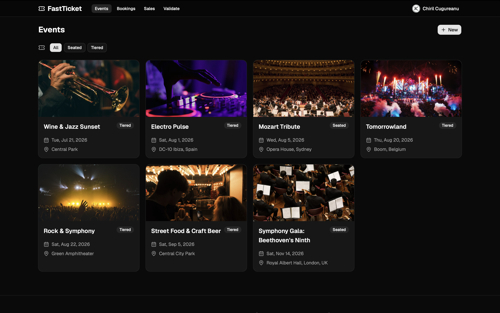
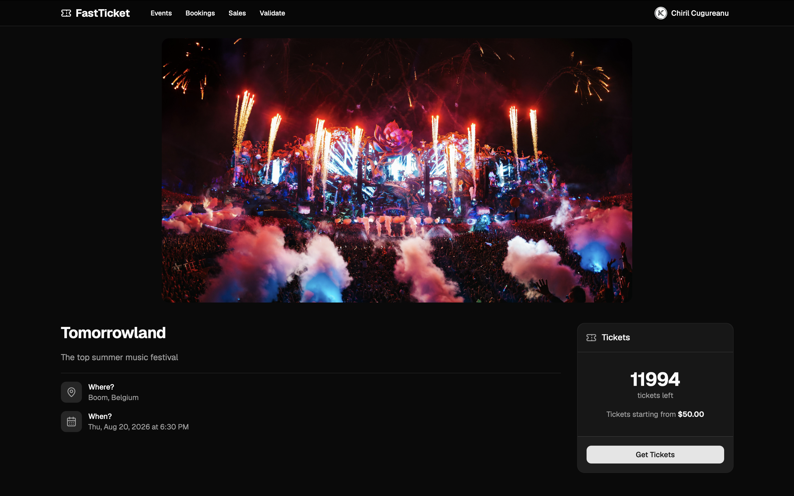
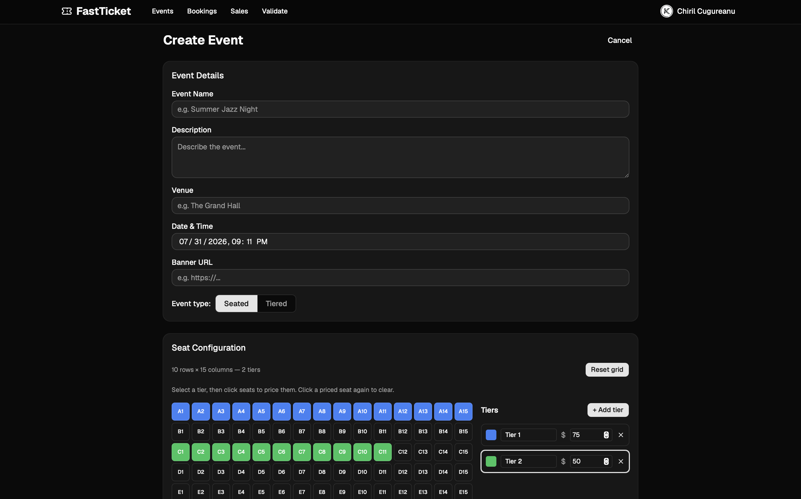
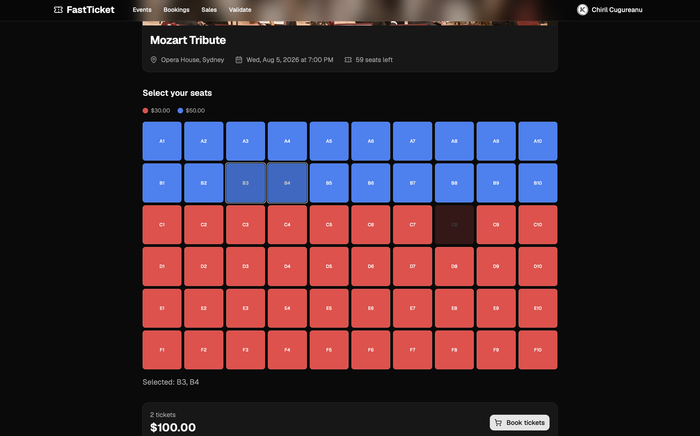
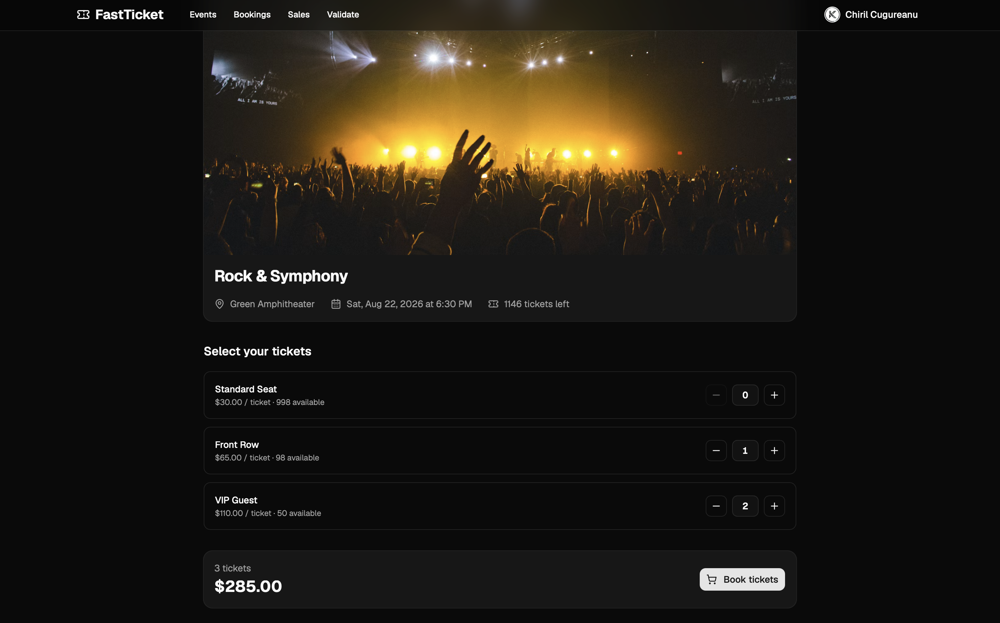
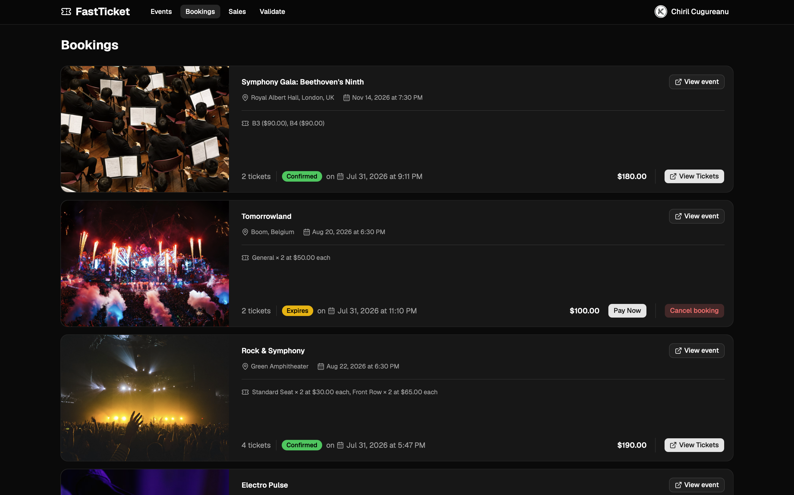
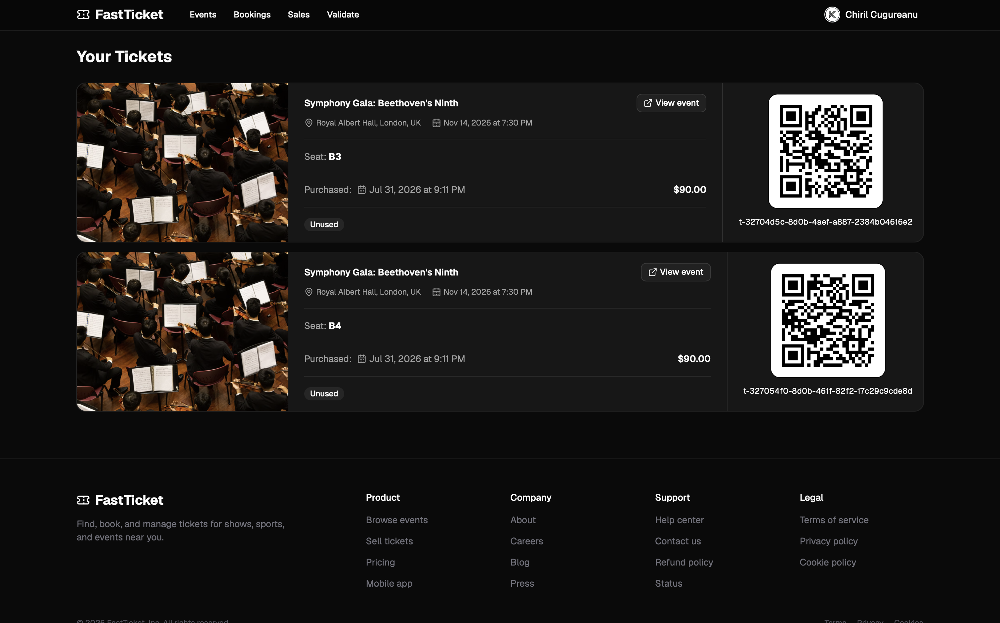
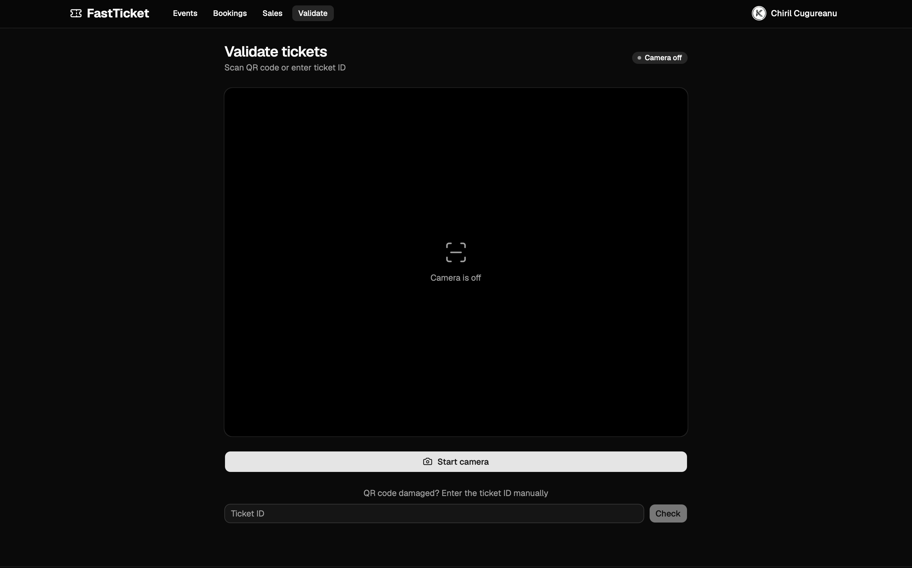
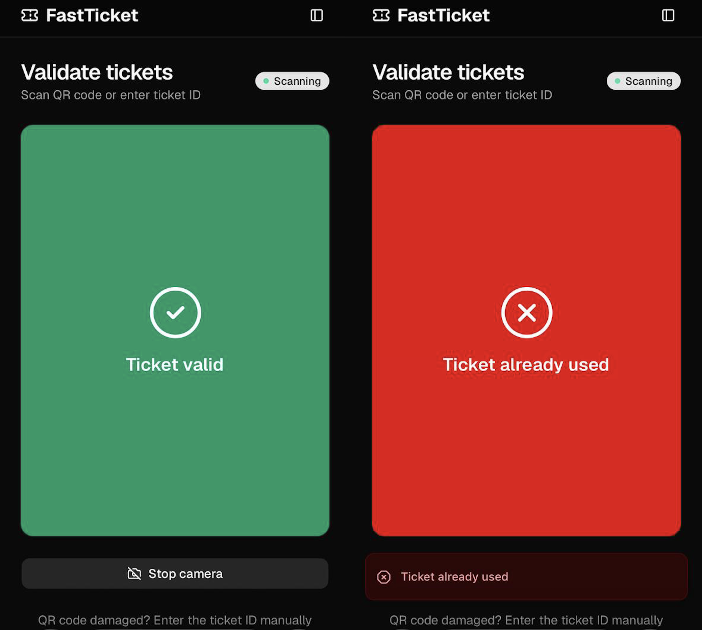
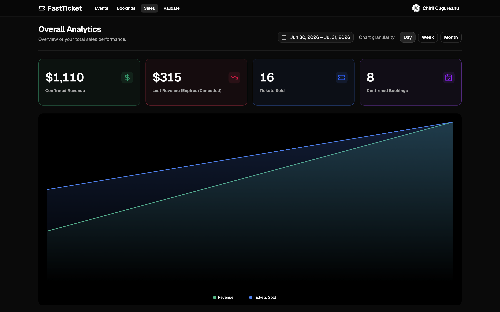

# FastTicket

### Stack:
- Backend: Python & FastAPI, Alembic for migrations, repositories use raw SQL (no ORM used), async psycopg, Pydantic
- Domain Driven Design backend architecture: adapters like repositories, methods for DB <-> Domain models mapping, entities, usecases, keeping everything loosely-coupled
- Frontend: TypeScript React (Vite), React Query, React Router, ShadCN, Tailwind
- AuthN/AuthZ: Auth0 with its React client and Auth0 JWKS validation on the backend for each user-related request
- Payments: Stripe
- Deployment: deployed on Google Cloud Run as two services (backend and frontend) by Github Actions through the github-deployer SA
- Infrastructure: the whole app infrastructure is available as IaC using Terraform: apply infrastructure/bootstrap once locally to create the remote backend inside a GCS bucket, the required WIF (Workload Identity Federation) components for Google auth inside the Github actions workflows & the necessary Service Accounts (github-deployer, terraform-planner and terraform-runner). Then CI/CD (through terraform-planner SA) runs "terraform plan" on pull requests to test the new infra code changes and to add a PR comment with the plan output for easier review, and finally runs "terraform apply" inside infrastructure/prod (through terraform-runner SA) on each PR merged into main.
- Testing: Pytest for the backend functionality and k6 for performance testing

### Features:
- Users can authenticate using the Auth0 hosted page, using classic credentials or social logins
- Admins can create events (with tiers or with seats configurations)
- Unauthenticated users can just view the existing events
- Authenticated users can view events and make bookings
- User has 2 hours to pay and confirm the booking, otherwise it expires and the resources get released
- User can also choose to just cancel the booking earlier, also releasing the resources
- After the user pays successfully, the Stripe confirmation webhook hits the backend, the booking gets confirmed, the corresponding payment DB row gets updated and the final tickets are generated
- Admins can access the Validate page and use the phone/computer camera to scan the tickets on the event day (or input the ticket ID manually), marking the tickets as used. Multiple scans of the same ticket or of a fake ticket result in an error screen
- Admins can also access the Sales page, allowing for granular financial and booking analytics and performance etc.
- Over 40 tests for the backend functionality, ensuring no overlapping bookings for the same seat or overselling ever occur, even under extreme concurrency. Achieved using DB locks (FOR UPDATE mainly), ensuring consistency and integrity.
- Performance tests using k6, achieving over 1500 RPS for the Events list -> Event -> Booking journey; booking takes the most time, as there are multiple DB ops & roundtrips needed for creating a booking (decrementing event (and tier) available tickets, marking seats as unavailable, creating the new booking row and mapping the resources to the user using separate join tables)

### Screenshots

